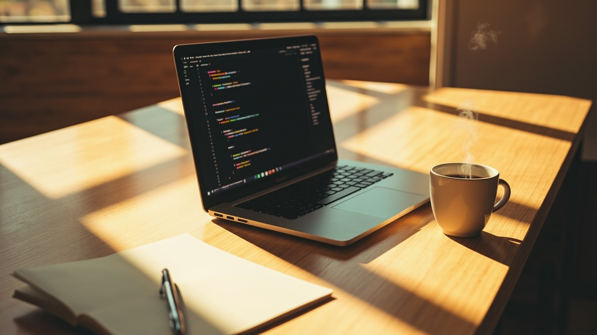

# 看了一圈AI工作流，我决定"少用点"

说出来有点反常识——

我焦虑感的最高峰，不是AI用得少的时候，恰恰是用得最多的时候。

---

## 我怎么掉进去的

大概三个月前，我开始认真研究"AI工作流"这件事。

起因是刷到太多帖子了——

> "我用AI做副业，月入3万"
> "这个工作流让我效率提升10倍"
> "全网最全AI工具合集，收藏=学会"

说真的，我一个也没点进去。

但我全都看了。

然后开始折腾——

这个AI写作试一下，那个AI搜索装一下，再来一个AI总结存一下……

一个月后，我的浏览器收藏夹有47个AI工具标签页，手机上有12个AI相关的App。

**你知道我实际在用几个吗？**

2个。

而且经常忘用。

---

## 问题在哪

我后来想明白了——**我掉进了"工具收集癖"的坑**。

这不是AI时代才有的毛病。

人类几千年前就有。买了跑鞋不一定去跑，买了书不一定去读，下载了健身App不一定去练。

**区别只是，以前收集的是书和跑鞋，现在收集的是AI工具。**

更讽刺的是——

我花了大量时间研究"怎么用AI提高效率"，但**研究本身占用了大量效率**。

这是个死循环：学习提效工具 → 花时间学工具 → 减少真正做事的时间。

---

## 还有一个问题

太多工具带来的是**决策疲劳**。

今天用Kimi还是Perplexity？豆包还是秘塔？这个文档是用AI写还是自己敲？

每多一个工具，就多一个"今天用哪个"的问题。

大脑不喜欢这种问题。所以最后干脆——

**都不用了。**

---

## 所以我现在怎么想

**少即是多。**

具体来说，三件事：

**1. 只留真正解决问题的**
现在我桌上只有两件事需要AI：
- 写东西卡住的时候，找它聊
- 某个话题完全不懂的时候，让它给我讲

就这两件。不是"全能助手"，就是两个具体的场景。

**2. 固定下来，不换了**
一旦找到合适的，就不换了。不用看新工具评测，不用管别人用什么。

我认识一个人，用备忘录写了三年日记。问她为什么不迁移到更"高级"的App，她说："因为已经习惯这个了。"我觉得她很智慧。

**3. 每天只问自己一个问题**
不是"今天用了几个AI工具"——

是**"今天有没有哪件事，因为用了AI，真的变快了？"**

如果没有，说明工具没帮上忙，该换的是工作方式，不是工具。

---

## 焦虑感的解药

其实我们真正焦虑的，不是"有没有用上最好的AI"。

是"别人都在用AI了，我是不是落后了"。

但你想——

**你用AI写一篇文章，别人用AI写十篇，谁更焦虑？**

很可能是那个写十篇的。

因为他在跟自己的"AI使用数量"赛跑。

---

**最后一句话：**

AI是用来省力的，不是用来证明你在努力的。

用得顺手，用得少，用得值——比什么都重要。

---

*看完如果觉得有共鸣，欢迎转发给那个也在"收集AI工具"的朋友。*
